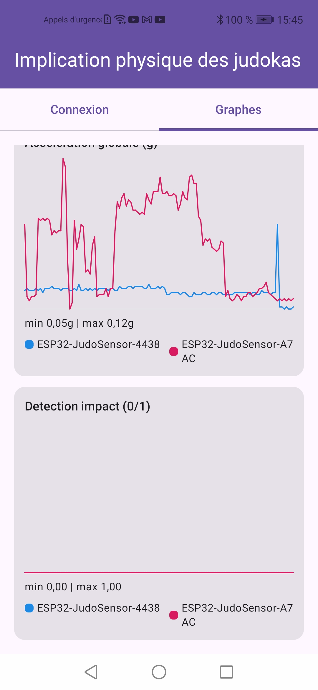
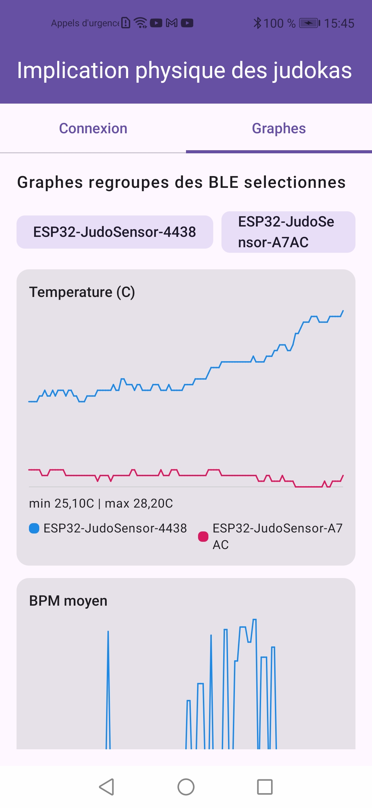
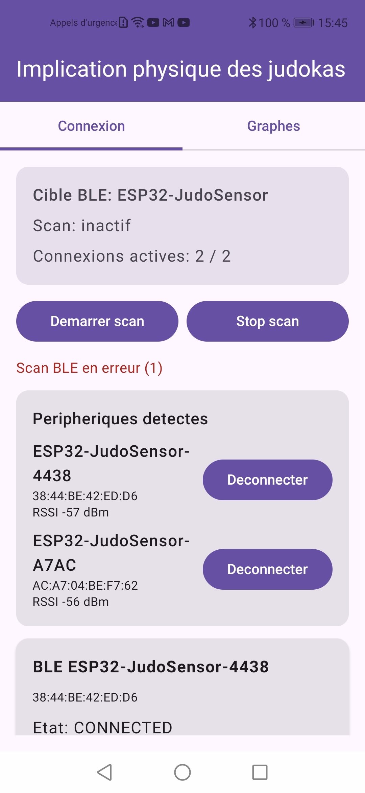
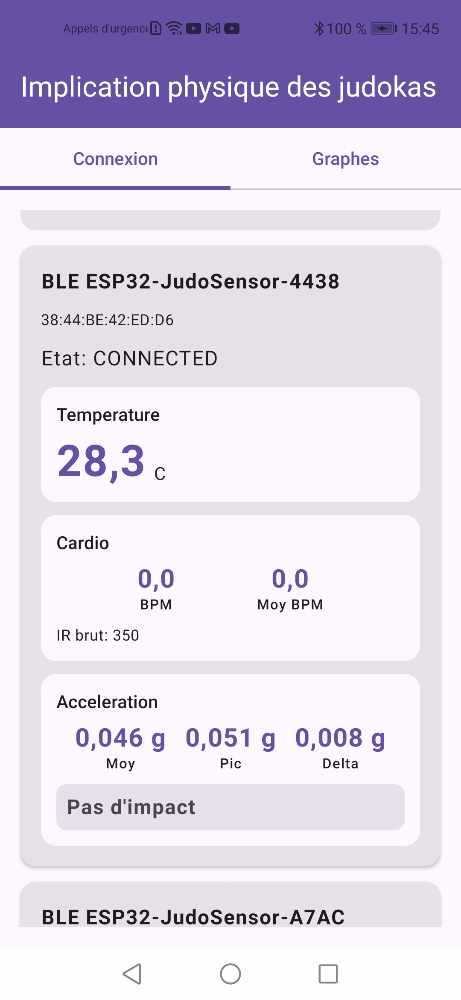
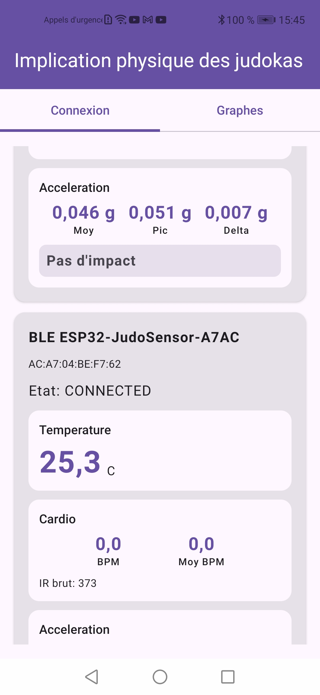
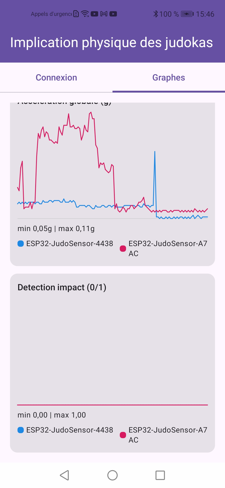
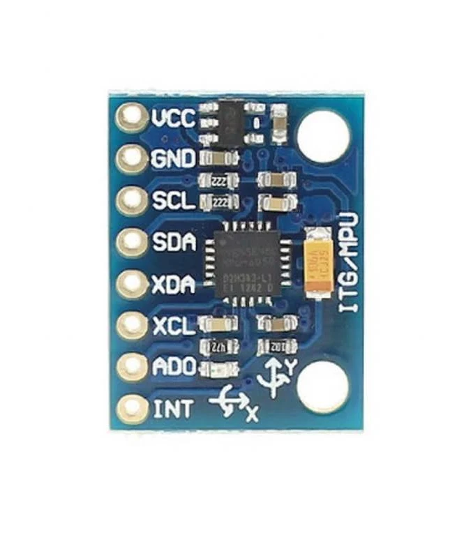
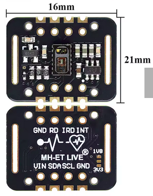
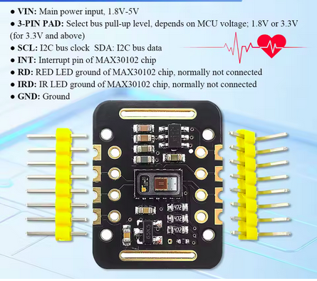

# Documentation

Index rapide des documents et captures. Les miniatures ci-dessous sont **cliquables** (ouvre l'image en taille réelle).

- Suivi de développement : [`DEVELOPPEMENT.md`](DEVELOPPEMENT.md)

## Captures d'écran

### Phase 1 (6 exemples)

Dossier complet : [`copies-ecrans-phase1/`](copies-ecrans-phase1/)

### Phase 2 – calibrage impact (6 exemples)

Dossier complet : [`copies-ecrans-phase2 calibrage impact/`](copies-ecrans-phase2%20calibrage%20impact/)

## Images (câblage / repères) — 6 exemples

Dossier complet : [`images/`](images/)

